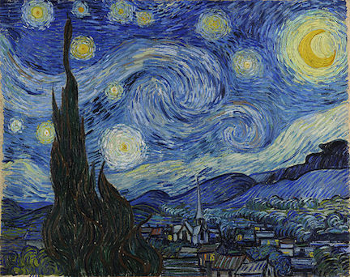

# Artistic Style Filter
### Ongoing

Objective: Create filters based on 10 paintings that can transform an input picture into the style of the given filter.
  
As my final project for Metis, I wanted to do something completely different from projects I had done before and touch on topics I had not tried. For that reason, I decided to do an image processing project.   
I thought it would be cool to train filters using neural networks that could transform ordinary pictures into true artistic masterpieces.

Based on https://github.com/fchollet/keras/blob/master/examples/neural_style_transfer.py

-------------------------------------------------------------------------------------------

### Results

Add Goldengate Bridge Picture (that I took) to Starry Night (Van Goh)
 

EQUALS 

------------------------------------------------------------------------------------------
Other Demos

  

  

