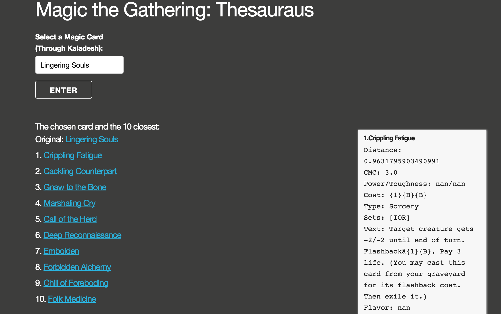

#Magic the Gathering: Similar Card Recommender

Data: https://www.kaggle.com/mylesoneill/magic-the-gathering-cards  
  
I started this project when attending Metis Data Science Bootcamp.  
I wanted to use natural language processing to cluster every card in the Magic the Gathering Catalog. I got the data from Kaggle.  
Once I had a model, I created a web app that can take a user inputted string, check if its a card in its database. If it is, the app provides the user with the 10 nearest cards and relevant information about those cards, including a link to cardkingdom.com for each card. The user can then see the price of the card there, and decide whether they want to buy it.

